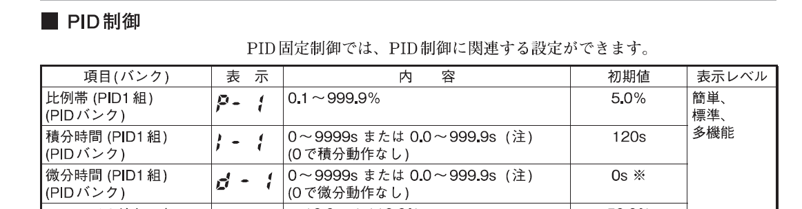
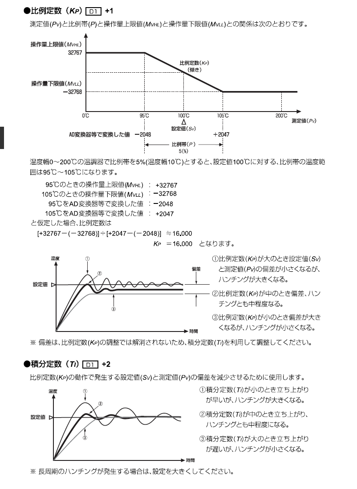
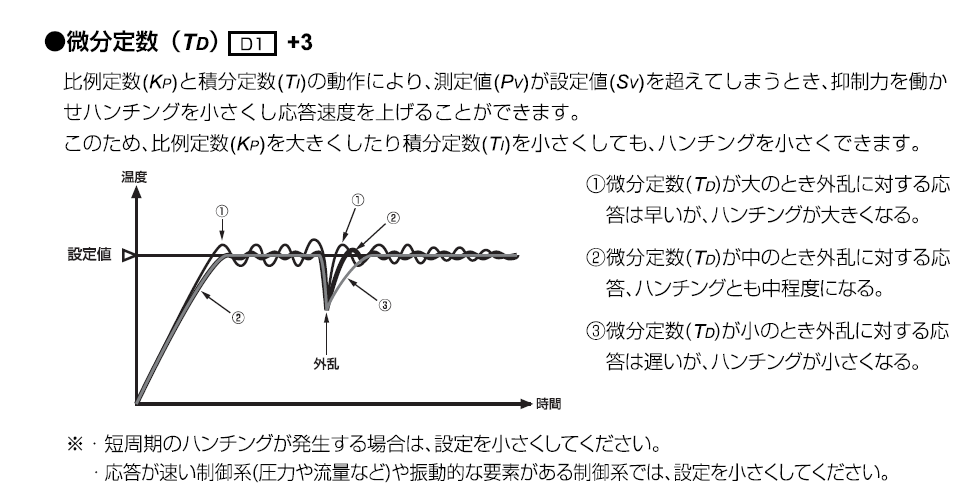
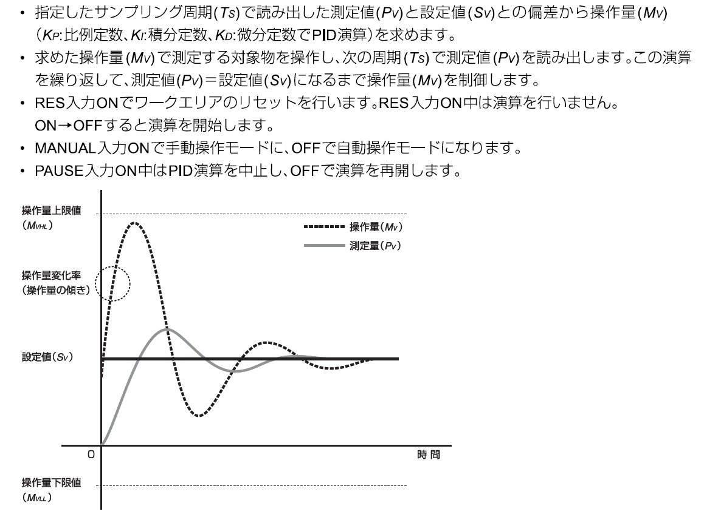

# アズビル → KV-8000 PID変換

アズビルの設定（図面値）を、キーエンスPLCに入力する数値に変換

※azbil R36参照

 
 
 

※keyence PID命令参照

## 1. P（比例）
アズビルの「％」を、PLCの「ゲイン（傾き）」に変換

`(MV幅 × 100000) ÷ (PV温度帯 × アズビルP)`

>※「PV温度帯」は、PLCプログラム内部のケタに合わせる。（例：>0～50.0℃で制御しているなら「50」ではなく「500」を入力）

 
 

## 2. I（積分）
アズビルの「秒」を、PLCの「0.1秒単位」に変換します。

> アズビルのIが `0` の場合 ＝ **30001** （※PLC側でIをOFFに>するための専用の数字）
> それ以外の場合 ＝ **アズビルI × 10**

 
 

## 3. D（微分）
アズビルの「秒」を、PLCの「0.01秒単位」に変換します。

>**アズビルD × 100**

---

### Excel用 

* P: `=ROUND((MV幅 * 100000) / (PV温度帯 * アズビルP), 0)`
* I: `=IF(アズビルI=0, 30001, ROUND(アズビルI*10, 0))`
* D: `=ROUND(アズビルD*100, 0)`